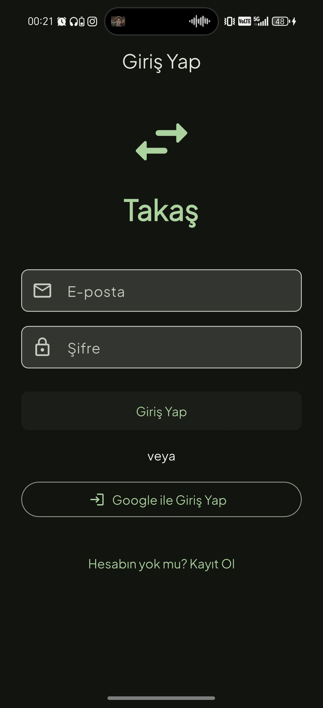

<div align="center">

# 🔁 Takaş

### Konum Tabanlı Mobil Takas Platformu

> yakınındaki insanlarla para kullanmadan eşya ve yetenek takası yap.

[](https://flutter.dev)
[](https://firebase.google.com)
[](https://riverpod.dev)
[](https://developer.android.com)
[](LICENSE)

<br/>



</div>

---

## 📖 Proje Hakkında

**Takaş**, sürdürülebilirliğe duyarlı şehirli kullanıcıların (18–40 yaş arası) yakınlarındaki insanlarla **para kullanmadan** eşya ve yetenek takası yapabilmelerini sağlayan konum tabanlı bir mobil platformdur.

Kullanıcılar ilanlarını oluşturur, harita üzerinde yakınlarındaki takasları keşfeder, uygulama içi mesajlaşma ile iletişim kurar ve güven puanlama sistemi ile güvenli bir takas deneyimi yaşar.

### ✨ Temel Özellikler

| Özellik | Açıklama |
|---------|----------|
| 🔐 **Kimlik Doğrulama** | E-posta/şifre, Google ve Telefon ile giriş |
| 📦 **İlan Yönetimi** | Çoklu fotoğraflı ilan oluşturma, düzenleme, silme ve durum yönetimi |
| 🗺️ **Harita & Konum** | Mapbox entegrasyonu ile yakındaki ilanları haritada görüntüleme |
| 💬 **Gerçek Zamanlı Sohbet** | Firestore tabanlı DM sistemi, fotoğraf gönderimi ve resim galerisi |
| ⭐ **Güven & Puanlama** | Takas sonrası 1-5 yıldızlı puanlama sistemi |
| 🔔 **Bildirimler** | FCM ile anlık push bildirimleri |
| 📍 **Geofencing** | Geoflutterfire+ ile yarıçap bazlı ilan filtreleme (5-10 km) |

---

## 🏗️ Mimari

Proje **Clean Architecture** prensiplerine göre yapılandırılmıştır:

```
lib/
├── main.dart                        # Uygulama giriş noktası
├── firebase_options.dart            # Firebase yapılandırması
├── app/
│   ├── router.dart                  # GoRouter tab-based navigasyon
│   └── theme.dart                   # Material 3 tema & renk sistemi
├── core/
│   ├── providers.dart               # Global Firebase provider'lar
│   ├── constants/                   # Sabit değerler & API anahtarları
│   ├── utils/                       # Yardımcı fonksiyonlar & validasyon
│   ├── extensions/                  # String uzantıları
│   ├── services/                    # Ayarlar servisi
│   └── providers/                   # Tema provider
├── features/
│   ├── auth/                        # Kimlik doğrulama (6 dosya)
│   │   ├── data/                    # AuthRepository
│   │   ├── domain/                  # UserModel
│   │   └── presentation/            # Login & Register ekranları
│   ├── listings/                    # İlan yönetimi (10 dosya)
│   │   ├── data/                    # ListingRepository
│   │   ├── domain/                  # ListingModel, kategori & durum
│   │   └── presentation/            # CRUD ekranları & widget'lar
│   ├── chat/                        # Mesajlaşma sistemi (5 dosya)
│   ├── map/                         # Harita & konum (4 dosya)
│   ├── profile/                     # Profil & puanlama (7 dosya)
│   ├── notifications/               # Bildirim yönetimi (4 dosya)
│   └── onboarding/                  # Tanıtım ekranları
└── shared/
    ├── widgets/                     # Paylaşılan UI bileşenleri
    ├── services/                    # Ortak servisler
    └── models/                      # Temel modeller
```

Her feature kendi **Data → Domain → Presentation** katmanlarına sahiptir.

---

## ⚙️ Teknoloji Yığını

| Katman | Teknoloji | Versiyon |
|--------|-----------|----------|
| **Framework** | Flutter | 3.x (SDK ≥3.4.0) |
| **State Management** | Riverpod + riverpod_generator | 2.6.1 |
| **Navigasyon** | GoRouter | 14.6.1 |
| **Auth** | Firebase Auth + Google Sign-In | 5.3.1 |
| **Veritabanı** | Cloud Firestore | 5.4.4 |
| **Depolama** | Firebase Storage | 12.3.4 |
| **Bildirimler** | Firebase Cloud Messaging | 15.1.3 |
| **Crash Raporlama** | Firebase Crashlytics | 4.1.3 |
| **Analitik** | Firebase Analytics | 11.3.3 |
| **Harita** | Mapbox Maps SDK | 2.4.0 |
| **Konum** | Geolocator + geoflutterfire_plus | 13.0.2 + 0.0.17 |
| **UI** | Material 3 + Google Fonts (Plus Jakarta Sans) | — |

<details>
<summary>📦 Tüm Bağımlılıklar</summary>

```yaml
dependencies:
  flutter_riverpod, riverpod_annotation    # State Management
  go_router                                # Navigation
  firebase_core, firebase_auth             # Firebase Core & Auth
  cloud_firestore, firebase_storage        # Database & Storage
  firebase_messaging, firebase_crashlytics # Messaging & Crash
  firebase_analytics                       # Analytics
  mapbox_maps_flutter                      # Maps
  geolocator, geoflutterfire_plus          # Location & Geofencing
  image_picker, image_cropper              # Medya İşleme
  cached_network_image                     # Resim Önbellekleme
  intl, uuid                              # Yerelleştirme & Benzersiz ID
  shared_preferences, flutter_dotenv       # Yerel Depolama & Env
  flutter_local_notifications              # Yerel Bildirimler
  google_fonts                             # Tipografi
  share_plus, url_launcher                 # Paylaşım & URL
  package_info_plus                        # Uygulama Bilgisi

dev_dependencies:
  riverpod_generator, build_runner         # Kod Üretimi
```

</details>

---

## 🗄️ Veritabanı Şeması (Firestore)

```
users/{userId}
  ├── uid, displayName, email, photoUrl, bio
  ├── rating (0-5), ratingCount
  ├── totalImageCount (chat resim limiti: 3)
  ├── fcmTokens: string[]
  └── createdAt

listings/{listingId}
  ├── id, ownerId, title, description, category
  ├── imageUrls: string[]
  ├── wantedItem
  ├── location: GeoPoint, geohash: string
  ├── status: active | reserved | completed
  └── createdAt

chats/{chatId}
  ├── id (uid1_uid2), participants, participantDetails
  ├── lastMessage, lastMessageAt, unreadCounts: map
  ├── imageCount, listingId, listingTitle
  └── messages/{messageId}
      ├── senderId, text, imageUrl, type, isRead
      └── createdAt

ratings/{ratingId}
  ├── fromUserId, toUserId, listingId, score
  └── createdAt

notifications/{notificationId}
  ├── userId, type, title, body, relatedId, isRead
  └── createdAt

users/{userId}/favorites/{listingId}
  └── (ListingModel kopyası)
```

---

## ☁️ Cloud Functions

| Fonksiyon | Açıklama |
|-----------|----------|
| `onNewMessage` | Yeni mesaj geldiğinde push bildirimi gönderir |
| `onNewOffer` | Yeni teklif geldiğinde bildirim oluşturur |
| `onTradeCompleted` | Takas tamamlandığında her iki tarafa bildirim gönderir |
| `onNewRating` | Puanlama yapıldığında kullanıcıya bildirim gönderir |
| `cleanupOldNotifications` | 30 günden eski okunmuş bildirimleri otomatik siler |

---

## 📱 Ekranlar & Navigasyon

```
Onboarding → Login / Register → Ana Sayfa (5 Tab)
  ├── 🏠 Keşfet        → HomeScreen → ListingDetailScreen
  ├── 🗺️ Harita        → MapScreen (Mapbox)
  ├── ➕ İlan Ver       → CreateListingScreen
  ├── 💬 Sohbetler     → ChatListScreen → ChatDetailScreen
  └── 👤 Profil        → ProfileScreen → EditProfile / MyListings / Favorites

Ek Rotalar:
  /user/:id  ·  /edit-profile  ·  /notifications  ·  /settings  ·  /edit-listing/:id
```

---

## 🚀 Kurulum

### Gereksinimler

- Flutter SDK ≥ 3.4.0
- Dart SDK ≥ 3.4.0
- Android Studio / VS Code
- Firebase CLI (`firebase-tools`)
- Mapbox hesabı ve API anahtarı

### Adımlar

```bash
# 1. Depoyu klonla
git clone https://github.com/kd196/takash.git
cd takash

# 2. Bağımlılıkları yükle
flutter pub get

# 3. Firebase'i yapılandır
flutterfire configure

# 4. .env dosyasını oluştur
cp .env.example .env
# Mapbox API anahtarını .env dosyasına ekle

# 5. Riverpod kodlarını üret
dart run build_runner build --delete-conflicting-outputs

# 6. Uygulamayı çalıştır
flutter run
```

> ⚠️ Firebase ve Mapbox API anahtarlarını kendi hesaplarınızdan temin etmeniz gerekmektedir.

---

## 🗺️ Yol Haritası

| Faz | Ad | Durum |
|:---:|-----|:-----:|
| 1 | Temel Altyapı & Auth | ✅ Tamamlandı |
| 2 | İlan Yönetimi | ✅ Tamamlandı |
| 3 | Konum & Harita | ⚠️ Kısmen Tamamlandı |
| 4 | Chat Sistemi (Firestore) | ✅ Tamamlandı |
| 5 | Puanlama & Güven | ✅ Tamamlandı |
| 6 | Bildirimler & Polish | ✅ Tamamlandı |
| 7 | Test & Beta | 🔜 Başlanacak |

---

## 🤝 Katkıda Bulunma

1. Bu depoyu **fork**'layın
2. Feature branch oluşturun (`git checkout -b feature/yeni-ozellik`)
3. Değişikliklerinizi commit'leyin (`git commit -m 'feat: yeni özellik eklendi'`)
4. Branch'inizi push'layın (`git push origin feature/yeni-ozellik`)
5. **Pull Request** açın

---

## 📄 Lisans

© 2026 Takaş — **Tüm Hakları Saklıdır.**

Bu proje açık kaynak olarak paylaşılmıştır ancak kaynak kodun tüm hakları proje sahibine aittir. İzinsiz kopyalama, dağıtma veya ticari kullanım yasaktır.

---

<div align="center">

**Takaş** ile sürdürülebilir bir topluluk inşa ediyoruz. 🌱

</div>
