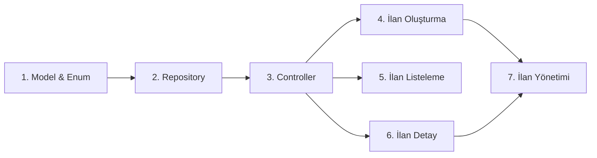

# Faz 2: İlan Yönetimi (Listings) — Detaylı Uygulama Planı

## 📌 Genel Bakış

Faz 2, kullanıcıların eşya ve yetenek ilanı oluşturmasını, listelemesini, aramasını ve yönetmesini sağlayan **CRUD** altyapısını kurar. Faz 1'de tamamlanan Auth + Profil sistemi üzerine inşa edilir.

**Tahmini Süre:** ~2 Hafta  
**Bağımlılık:** Faz 1 (Auth, Profil, Firebase) ✅ Tamamlandı

---

## 🗂️ Kullanılacak Skill Dosyaları ve Kullanım Yerleri

| Skill Dosyası | Hangi Adımda | Ne İçin |
|---|---|---|
| `skill_02_listings.md` | **Tüm adımlar** | Ana referans: Model, Repository, Ekranlar |
| `skill_03_map.md` | Adım 2 & 5 | İlan oluştururken konum seçme + geohash kaydetme |
| `skill_07_security_rules.md` | Adım 7 | Firestore & Storage güvenlik kuralları |
| `skill_09_error_handling.md` | Adım 6 | Repository try-catch, Failure modelleri |
| `PROJECT_CONTEXT.md` | Referans | Firestore koleksiyon yapısı, navigasyon akışı |

---

## 🚀 Uygulama Adımları

### Adım 1 — Veri Modeli & Enum'lar
> **Skill:** `skill_02_listings.md` → İlan Modeli bölümü

#### [MODIFY] `lib/features/listings/domain/listing_category.dart`
```dart
enum ListingCategory {
  electronics,  // Elektronik
  clothing,     // Giyim
  books,        // Kitap
  furniture,    // Mobilya
  sports,       // Spor
  toys,         // Oyuncak
  other,        // Diğer
}

enum ListingStatus { active, reserved, completed }
```
- Türkçe label'lar için bir `extension` eklenecek (UI'da gösterim için)

#### [MODIFY] `lib/features/listings/domain/listing_model.dart`
```dart
class ListingModel {
  final String id;
  final String ownerId;
  final String title;
  final String description;
  final ListingCategory category;
  final List<String> imageUrls;
  final String wantedItem;       // "Karşılığında ne istiyorum"
  final GeoPoint location;
  final String geohash;
  final ListingStatus status;
  final DateTime createdAt;
}
```
- `toJson()`, `fromJson()`, `copyWith()` metodları eklenecek
- `PROJECT_CONTEXT.md`'deki Firestore şeması bire bir takip edilecek

---

### Adım 2 — Repository Katmanı
> **Skill:** `skill_02_listings.md` → Repository Metodları + Firebase Storage Yapısı  
> **Skill:** `skill_03_map.md` → Geohash hesaplama (ilan kaydederken)

#### [MODIFY] `lib/features/listings/data/listing_repository.dart`

**Implement edilecek metodlar:**

| Metod | Açıklama | Skill Referansı |
|---|---|---|
| `createListing(ListingModel)` | Yeni ilan Firestore'a kaydet | `skill_02` |
| `updateListing(ListingModel)` | Mevcut ilanı güncelle | `skill_02` |
| `deleteListing(String id)` | İlanı ve fotoğraflarını sil | `skill_02` |
| `getListingById(String id)` | Tek ilan getir | `skill_02` |
| `getUserListings(String userId)` | Kullanıcının ilanları (Stream) | `skill_02` |
| `getAllActiveListings()` | Tüm aktif ilanlar (pagination) | `skill_02` |
| `searchListings(String query)` | Başlık bazlı arama | `skill_02` |
| `uploadImages(List<File>, String id)` | Fotoğrafları Storage'a yükle | `skill_02` |
| `deleteImages(String listingId)` | İlan fotoğraflarını sil | `skill_02` |

**Storage yapısı:** `listings/{listingId}/image_0.jpg, image_1.jpg...` (skill_02'den)

**Geohash:** İlan oluşturulurken konum bilgisiyle birlikte geohash hesaplanacak (skill_03 referansı, Faz 3'te tam geofencing sorgusuna geçilecek ama geohash şimdiden kaydedilecek)

**Pattern:** `auth_repository.dart`'taki mevcut Riverpod Provider pattern'i takip edilecek

---

### Adım 3 — Controller (Riverpod State Yönetimi)
> **Skill:** `skill_02_listings.md` → Riverpod controller yapısı

#### [MODIFY] `lib/features/listings/presentation/listings_controller.dart`

**Oluşturulacak Provider'lar:**

| Provider | Tip | Amaç |
|---|---|---|
| `listingRepositoryProvider` | `Provider` | Repository instance |
| `allListingsProvider` | `StreamProvider` | Tüm aktif ilanlar |
| `userListingsProvider` | `StreamProvider.family` | Bir kullanıcının ilanları |
| `singleListingProvider` | `FutureProvider.family` | Tek ilan detayı |
| `createListingControllerProvider` | `AsyncNotifierProvider` | İlan oluşturma state (loading/error) |
| `searchQueryProvider` | `StateProvider` | Arama text'i |
| `categoryFilterProvider` | `StateProvider` | Kategori filtresi |
| `filteredListingsProvider` | `Provider` | Filtrelenmiş ilan listesi |

---

### Adım 4 — İlan Oluşturma Ekranı
> **Skill:** `skill_02_listings.md` → create_listing_screen örneği

#### [MODIFY] `lib/features/listings/presentation/create_listing_screen.dart`

**UI Bileşenleri:**
- Başlık `TextField` (max 100 karakter)
- Açıklama `TextField` (max 500 karakter, multiline)
- Kategori `DropdownButtonFormField` (ListingCategory enum)
- "Karşılığında ne istiyorum" `TextField`
- Fotoğraf seçici: `image_picker` ile max 5 fotoğraf (galeri + kamera)
- Fotoğraf önizleme grid'i (silme butonu ile)
- "İlanı Yayınla" butonu → `createListingController` çağrısı
- Form validasyonu: `Validators` sınıfından (mevcut `core/utils/validators.dart`)
- Loading durumu ve hata mesajları

> [!NOTE]
> Konum seçimi bu adımda basit tutulacak (cihaz konumu otomatik alınacak). Haritadan pin ile seçim Faz 3'te eklenecek.

---

### Adım 5 — İlan Listeleme (Ana Sayfa)
> **Skill:** `skill_02_listings.md` → home_screen ve Firestore sorgu örneği

#### [MODIFY] `lib/features/listings/presentation/home_screen.dart`

**UI Bileşenleri:**
- Üst kısım: Arama çubuğu + Kategori filtre chip'leri
- İlan kartları: `ListView.builder` ile sonsuz scroll
- Her kart: Fotoğraf (CachedNetworkImage), başlık, kategori badge'i, zaman bilgisi, "ne istiyor" özeti
- Boş durum: "Henüz ilan yok" görseli
- Pull-to-refresh
- İlana tıklayınca → `/listing/:id` rotasına yönlendirme

#### [NEW] `lib/features/listings/presentation/widgets/listing_card.dart`
- Tekrar kullanılabilir ilan kartı widget'ı

---

### Adım 6 — İlan Detay Ekranı
> **Skill:** `skill_02_listings.md` → listing_detail_screen  
> **Skill:** `skill_09_error_handling.md` → Hata yönetimi pattern'i

#### [MODIFY] `lib/features/listings/presentation/listing_detail_screen.dart`

**UI Bileşenleri:**
- Fotoğraf carousel (`PageView`)
- İlan bilgileri: Başlık, açıklama, kategori, "ne istiyor"
- İlan sahibi mini profil kartı (isim, foto, puan) → `UserModel` kullanarak
- Tarih bilgisi (ne zaman yayınlandı)
- "Teklif Ver" butonu → Faz 4'te chat başlatacak (şimdilik placeholder)
- Favori butonu ❤️ (şimdilik local state, ileride Firestore)
- İlan sahibi kendisiyse: Düzenle / Sil butonları

---

### Adım 7 — İlan Yönetimi (Sahip İşlemleri)
> **Skill:** `skill_02_listings.md` → CRUD metodları  
> **Skill:** `skill_07_security_rules.md` → Listings güvenlik kuralları

#### [NEW] `lib/features/listings/presentation/my_listings_screen.dart`
- Profil ekranından erişilebilir "İlanlarım" sayfası
- Aktif / Rezerve / Tamamlandı tab'ları
- İlan düzenleme (create_listing_screen'i edit modunda aç)
- İlan silme (onay dialog'u ile)
- Durum değiştirme (aktif ↔ rezerve)

#### Firestore Security Rules (`skill_07` referansı)
```javascript
match /listings/{listingId} {
  allow read: if request.auth != null;
  allow create: if request.auth != null && 
    request.resource.data.ownerId == request.auth.uid;
  allow update, delete: if request.auth != null && 
    resource.data.ownerId == request.auth.uid;
}
```

---

## 📁 Dosya Yapısı Özeti (Faz 2 Sonrası)

```
lib/features/listings/
├── data/
│   └── listing_repository.dart      ← CRUD + Storage işlemleri
├── domain/
│   ├── listing_model.dart           ← toJson/fromJson/copyWith
│   └── listing_category.dart        ← Enum + Türkçe label extension
└── presentation/
    ├── home_screen.dart             ← İlan listesi + arama + filtre
    ├── listing_detail_screen.dart   ← Detay + carousel + teklif ver
    ├── create_listing_screen.dart   ← Oluşturma/düzenleme formu
    ├── my_listings_screen.dart      ← [YENİ] Kendi ilanlarım
    ├── listings_controller.dart     ← Riverpod providers
    └── widgets/
        └── listing_card.dart        ← [YENİ] Tekrar kullanılabilir kart
```

---

## 🔄 Uygulama Sırası



> [!IMPORTANT]
> Sıra önemli! Model → Repository → Controller → UI akışını takip et. Aksi halde bağımlılık hataları alırsın.

---

## ⚠️ Faz 3'e Bırakılan Konular

| Konu | Neden Bırakıldı |
|---|---|
| Haritadan konum seçme (pin atma) | Mapbox entegrasyonu Faz 3'te |
| Geofencing sorguları (yakın ilanlar) | `skill_03_map.md` Faz 3'te |
| Mesafe bilgisini kartta gösterme | Konum sistemi Faz 3'te |

Bu adımlar için şimdilik cihazın mevcut konumu (`geolocator`) otomatik alınıp basit bir `GeoPoint` olarak kaydedilecek.

---

## Verification Plan

### Manual Verification
1. Yeni ilan oluştur → Firestore konsolunda `listings` koleksiyonunda göründüğünü doğrula
2. Fotoğraf yükleme → Firebase Storage'da `listings/{id}/` altında fotoğrafları gör
3. Ana sayfada ilan kartlarının doğru göründüğünü kontrol et
4. Kategori filtresini değiştir → listenin güncellendiğini gör
5. İlan detayına tıkla → tüm bilgilerin doğru gösterildiğini kontrol et
6. Kendi ilanını düzenle ve sil → Firestore'da güncellendiğini doğrula
