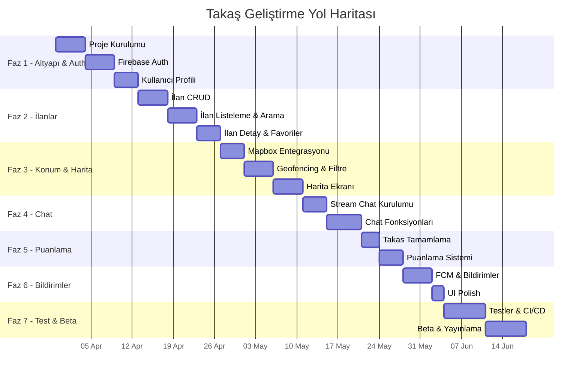
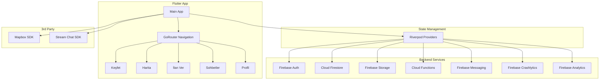

# 🗺️ Takaş — Kapsamlı Yol Haritası

## 📌 Proje Özeti

**Takaş**, konum tabanlı bir mobil takas platformudur. Kullanıcılar mahallelerindeki insanlarla para kullanmadan eşya ve yetenek takası yapar.

| Özellik | Detay |
|---|---|
| **Platform** | iOS + Android (Flutter) |
| **Hedef Kitle** | 18–40 yaş, sürdürülebilirliğe duyarlı şehirliler |
| **Mimari** | Clean Architecture (Feature-First) |
| **State Yönetimi** | Riverpod |
| **Backend** | Firebase (Serverless) |
| **Harita** | Mapbox SDK |
| **Chat** | Stream Chat SDK |

---

## 🎯 Geliştirme Fazları & Detaylı Görevler



---

### FAZ 1 — Temel Altyapı & Auth (~2 Hafta)

> **Amaç:** Projenin iskeletini kurmak ve kullanıcı kimlik doğrulamayı sağlamak.

#### 1.1 Proje Kurulumu
| Görev | Skill Dosyası | Durum |
|---|---|---|
| Flutter projesi oluştur (`flutter create takash`) | `skill_00` | ⬜ |
| `pubspec.yaml`'a paketleri ekle (~20 paket) | `skill_00` | ⬜ |
| Firebase projesi oluştur + `flutterfire configure` | `skill_00` | ⬜ |
| `.env` dosyası oluştur (API anahtarları) | `skill_00` | ⬜ |
| GoRouter ile 5 tab'lı navigation kur | `skill_00` | ⬜ |
| Riverpod + Global Providers kur | `skill_00` | ⬜ |
| Material 3 tema sistemi oluştur | `skill_00` | ⬜ |
| Klasör yapısını oluştur (features/, core/, shared/) | `skill_00` | ⬜ |
| Android/iOS yapılandırması (izinler, Mapbox token) | `skill_00` | ⬜ |

#### 1.2 Firebase Auth
| Görev | Skill Dosyası | Durum |
|---|---|---|
| Google ile giriş | `skill_01` | ⬜ |
| E-posta / şifre ile giriş | `skill_01` | ⬜ |
| Telefon numarası ile giriş | `skill_01` | ⬜ |
| Çıkış yapma | `skill_01` | ⬜ |
| Auth state listener | `skill_01` | ⬜ |
| Firestore'a kullanıcı profili kaydetme | `skill_01` | ⬜ |

#### 1.3 Kullanıcı Profili
| Görev | Skill Dosyası | Durum |
|---|---|---|
| Profil görüntüleme ekranı | `skill_01` | ⬜ |
| Profil düzenleme (isim, bio, fotoğraf) | `skill_01` | ⬜ |
| Firebase Storage'a profil fotoğrafı yükleme | `skill_01` | ⬜ |
| Diğer kullanıcıların profilini görüntüleme | `skill_01` | ⬜ |

> **Faz 1 Çıktıları:** `auth_repository.dart`, `user_model.dart`, `login_screen.dart`, `register_screen.dart`, `profile_screen.dart`, `router.dart`, `theme.dart`

---

### FAZ 2 — İlan Yönetimi (~2 Hafta)

> **Amaç:** Kullanıcıların eşyalarını ilan olarak listeleyebilmesini sağlamak.

#### 2.1 İlan Oluşturma
| Görev | Skill Dosyası | Durum |
|---|---|---|
| İlan formu (başlık, açıklama, kategori dropdown) | `skill_02` | ⬜ |
| Çoklu fotoğraf yükleme (maks 5, Firebase Storage) | `skill_02` | ⬜ |
| "Karşılığında ne istiyorum" alanı | `skill_02` | ⬜ |
| İlan önizleme | `skill_02` | ⬜ |
| Firestore'a kaydetme | `skill_02` | ⬜ |

#### 2.2 İlan Listeleme
| Görev | Skill Dosyası | Durum |
|---|---|---|
| Ana sayfa ilan listesi (kart tasarımı) | `skill_02` | ⬜ |
| Kategori filtresi | `skill_02` | ⬜ |
| Arama fonksiyonu | `skill_02` | ⬜ |
| Sonsuz scroll (pagination) | `skill_02` | ⬜ |

#### 2.3 İlan Detay & Yönetim
| Görev | Skill Dosyası | Durum |
|---|---|---|
| Fotoğraf carousel | `skill_02` | ⬜ |
| İlan sahibinin mini profil kartı | `skill_02` | ⬜ |
| "Teklif Ver" butonu | `skill_02` | ⬜ |
| Favorilere ekleme | `skill_02` | ⬜ |
| Kendi ilanlarını düzenleme/silme | `skill_02` | ⬜ |
| İlan durumu değiştirme (aktif/rezerve/tamamlandı) | `skill_02` | ⬜ |

> **Faz 2 Çıktıları:** `listing_model.dart`, `listing_category.dart`, `listing_repository.dart`, `home_screen.dart`, `create_listing_screen.dart`, `listing_detail_screen.dart`

---

### FAZ 3 — Konum & Harita (~2 Hafta)

> **Amaç:** Konum bazlı ilan filtreleme ve harita üzerinde gösterme.

| Görev | Skill Dosyası | Durum |
|---|---|---|
| Mapbox SDK Flutter entegrasyonu | `skill_03` | ⬜ |
| Kullanıcı konumunu alma (geolocator) | `skill_03` | ⬜ |
| Konum izni yönetimi | `skill_03` | ⬜ |
| İlan oluştururken haritadan konum seçme | `skill_03` | ⬜ |
| Geohash hesaplama fonksiyonu | `skill_03` | ⬜ |
| 5–10 km yarıçaplı geofencing sorguları | `skill_03` | ⬜ |
| Ana sayfada yakın ilanları gösterme | `skill_03` | ⬜ |
| Harita ekranında marker'lar ile ilanlar | `skill_03` | ⬜ |
| Marker'a tıklayınca ilan özeti (bottom sheet) | `skill_03` | ⬜ |
| Yarıçap ayarı (kullanıcı 5-10 km seçebilir) | `skill_03` | ⬜ |

> **Faz 3 Çıktıları:** `location_service.dart`, `geo_repository.dart`, `map_screen.dart`, `map_controller.dart`

---

### FAZ 4 — Chat Sistemi (~1.5 Hafta)

> **Amaç:** Kullanıcılar arası gerçek zamanlı mesajlaşma.

| Görev | Skill Dosyası | Durum |
|---|---|---|
| Stream Chat SDK kurulumu | `skill_04` | ⬜ |
| Firebase Cloud Function ile token üretimi | `skill_04` | ⬜ |
| Stream'e kullanıcı kaydı | `skill_04` | ⬜ |
| "Teklif Ver" → yeni sohbet başlatma | `skill_04` | ⬜ |
| Sohbet listesi ekranı | `skill_04` | ⬜ |
| Sohbet detay ekranı (mesajlaşma) | `skill_04` | ⬜ |
| Fotoğraf gönderme | `skill_04` | ⬜ |
| "Yazıyor..." göstergesi + okundu bilgisi | `skill_04` | ⬜ |

> **Faz 4 Çıktıları:** `chat_repository.dart`, `chat_list_screen.dart`, `chat_detail_screen.dart`, Cloud Function (`getStreamToken`)

---

### FAZ 5 — Puanlama & Güven (~1 Hafta)

> **Amaç:** Takas sonrası karşılıklı puanlama ile güven sistemi.

| Görev | Skill Dosyası | Durum |
|---|---|---|
| "Takas Tamamlandı" butonu (her iki taraf onaylamalı) | `skill_05` | ⬜ |
| İlan durumunu "completed" olarak güncelleme | `skill_05` | ⬜ |
| Puanlama ekranı (1-5 yıldız + yorum) | `skill_05` | ⬜ |
| Puanı Firestore'a kaydetme | `skill_05` | ⬜ |
| Cloud Function ile ortalama puan güncelleme | `skill_05` | ⬜ |
| Profilde puanları gösterme | `skill_05` | ⬜ |

> **Faz 5 Çıktıları:** `rating_model.dart`, `rating_repository.dart`, `rating_screen.dart`, Cloud Function (`onRatingCreated`)

---

### FAZ 6 — Bildirimler & Son Dokunuşlar (~1 Hafta)

> **Amaç:** Push bildirimleri, UI cilalama ve kullanıcı deneyimi iyileştirme.

| Görev | Skill Dosyası | Durum |
|---|---|---|
| FCM kurulumu + izin yönetimi | `skill_06` | ⬜ |
| Yeni mesaj bildirimi | `skill_06` | ⬜ |
| Yeni teklif bildirimi | `skill_06` | ⬜ |
| Takas tamamlandı bildirimi | `skill_06` | ⬜ |
| Uygulama ikonu ve splash screen | — | ⬜ |
| Onboarding ekranları | — | ⬜ |
| Boş durum ekranları | — | ⬜ |
| Hata yönetimi (ErrorHandler, Crashlytics) | `skill_09` | ⬜ |
| Analytics entegrasyonu | `skill_10` | ⬜ |

> **Faz 6 Çıktıları:** `notification_service.dart`, `error_handler.dart`, `analytics_service.dart`, Cloud Functions (bildirim gönderme)

---

### FAZ 7 — Test & Beta (~2 Hafta)

> **Amaç:** Kalite güvence, güvenlik kuralları ve mağaza yayınlama.

| Görev | Skill Dosyası | Durum |
|---|---|---|
| Unit testler (model + repository) | `skill_08` | ⬜ |
| Widget testleri | `skill_08` | ⬜ |
| Integration testler | `skill_08` | ⬜ |
| Firestore güvenlik kuralları | `skill_07` | ⬜ |
| Storage güvenlik kuralları | `skill_07` | ⬜ |
| GitHub Actions CI/CD pipeline | `skill_08` | ⬜ |
| Performans optimizasyonu | — | ⬜ |
| Beta kullanıcı grubu (10-20 kişi) | — | ⬜ |
| App Store & Play Store hazırlığı | — | ⬜ |

---

## 💰 Maliyet Özeti

| Aşama | Kullanıcı Sayısı | Aylık Maliyet |
|---|---|---|
| 🟢 Geliştirme + MVP | 0 – 1.000 | **$0** |
| 🟡 İlk Büyüme | 1.000 – 10.000 | **$15 – 40** |
| 🔴 Ölçek | 10.000+ | **$580 – 750** |

---

## 🏗️ Teknoloji Mimarisi



---

## 📁 Proje Dosya Yapısı

```
lib/
├── main.dart
├── firebase_options.dart
├── app/
│   ├── router.dart                → GoRouter (5 tab)
│   └── theme.dart                 → Material 3
├── core/
│   ├── constants/                 → API keys, config
│   ├── utils/                     → validators, helpers
│   ├── extensions/                → Dart extensions
│   ├── errors/                    → exceptions, failures, error_handler
│   └── analytics/                 → analytics_service, events, observer
├── features/
│   ├── auth/          (data / domain / presentation)
│   ├── listings/      (data / domain / presentation)
│   ├── chat/          (data / domain / presentation)
│   ├── map/           (data / domain / presentation)
│   ├── profile/       (data / domain / presentation)
│   └── notifications/ (data / domain / presentation)
└── shared/
    ├── widgets/                   → custom_button, text_field, loading
    ├── models/                    → base_model
    └── services/                  → firebase_service, storage_service
```

---

## 🚀 Hemen Başlamak İçin İlk Adım

> **Faz 1.1 — Proje Kurulumu** ile başla. Aşağıdaki komutu çalıştır:

```bash
flutter create takash --org com.takash
cd takash
```

Ardından [skill_00_setup.md](file:///c:/Users/yenik/Desktop/taka%C5%9F/files/skill_00_setup.md) dosyasındaki tüm adımları takip et.

> [!IMPORTANT]
> Her faz için ilgili skill dosyasını referans al. Aynı anda birden fazla faz üzerinde çalışma — her fazı sırayla tamamla.
